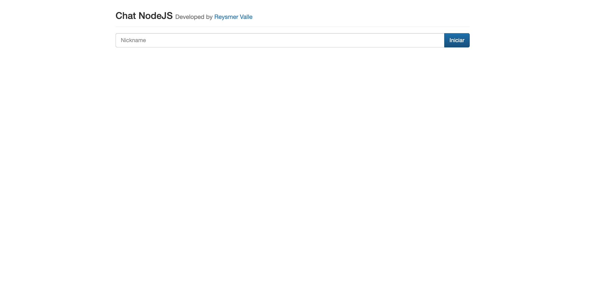
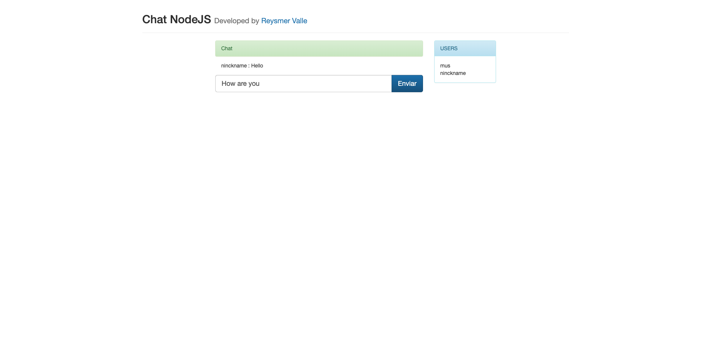

# Chat NodeJS

Chat NodeJS

## Requirements

- Node >= 12.10.0
- Express >= 4.17.1
- SocketIO >= 2.3.0

## Version

1.0.0

## Installation

Download zip file and extract it [latest release](https://github.com/reysmerwvr/chat_nodejs). Or clone the repository and cd into it.

Chat NodeJS uses a number of open source projects to work properly:

- [Node] - Open-source, cross-platform, JavaScript runtime.
- [Express] - Fast, unopinionated, minimalist web framework for Node.js
- [Socket.io] - Featuring the fastest and most reliable real-time engine

Install the dependencies and start the server.

## Run

```sh
cd chat_nodejs
node app.js
```

## Preview




## Meta

Reysmer Valle – [@ReysmerWVR]

## License

Chat NodeJS is (c) 2020 Reysmer Valle ([@ReysmerWVR]) and may be freely distributed under the [license-url](https://github.com/reysmerwvr/chat_nodejs/tree/master/LICENSE). See the `MIT-LICENSE` file.

### Todos

- Write tests
- Add code comments

[//]: # (These are reference links used in the body of this note and get stripped out when the markdown processor does 
its job. There is no need to format nicely because it shouldn't be seen. Thanks SO - http://stackoverflow.com/questions/4823468/store-comments-in-markdown-syntax)

   [Node]: <https://nodejs.org/en/>
   [Express]: <https://expressjs.com/>
   [Socket.io]: <https://socket.io/>
   [@ReysmerWVR]: <http://twitter.com/ReysmerWVR>